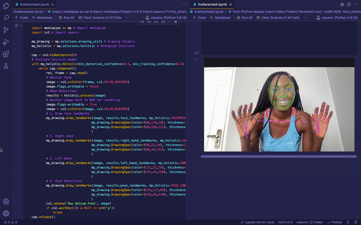

# face-and-body-detector-with-mediapipe

This code detects face and body landmarks using mediapipe, a python ML package. (This code is adapted from [nicknochnack's](https://github.com/nicknochnack) longer tutorial on using mediapipe for body language detection that can be found [here](https://github.com/nicknochnack/Body-Language-Decoder/blob/main/Body%20Language%20Decoder%20Tutorial.ipynb).  

It's important to note that MediaPipe Python on PyPI officially supports the 64-bit version of Python 3.7 to 3.10 on the following OS:

- x86_64 Linux
- x86_64 macOS 10.15+
- amd64 Windows

You'll need to be using a virtual environment that's running one of these versions of Python. 

## Mac0S

(The following steps are courtesy of user [josiahsrc](https://github.com/josiahsrc) on GitHub and [stackoverflow](https://stackoverflow.com/questions/68659865/cannot-pip-install-mediapipe-on-macos-m1)

Here are the steps you need to take in order to use mediapipe with Apple's M1:

1. Launch terminal using the Rosetta 2 translation layer. You can do this by opening Finder, going to Applications > Utilities and right clicking Terminal. In the right-click menu, click on get-info and then tick the Open Using Rosetta checkbox.

2. Open a new Terminal window. (If terminal was previously opened, quit and relaunch it).

3. Use the following command to install Homebrew for x86_64 architecture. arch -x86_64 /bin/bash -c "$(curl -fsSL https://raw.githubusercontent.com/Homebrew/install/master/install.sh)". We do this because we'd like to install Python 3.8 for x86_64 where mediapipe is supported.

4. Now that we have brew for x86_64, we can install Python 3.8 for x86_64 by running the command arch -x86_64 /usr/local/homebrew/bin/brew install python@3.8. This installation may take a while.

5. Now that we have the Python version we need, we can create a new Virtual Environment. By using the command arch -x86_64 /usr/local/homebrew/opt/python@3.8/bin/python3 -m venv myvenv. Remember, you need to specify your path to the x86_64 Python (the one we just installed). For me it was installed to /usr/local/homebrew/opt/python@3.8/bin/python3. For you it could be different. Either ways after Brew finishes installing Python, it'll display the path it was installed to. You should see "Python was installed at /Path/to/newly/installed/python". Also, the Virtual Environment will be created at ~/myvenv. You can change that by changing the myvenv part in the command.

6. Start your Virtual Environment source ~/myvenv/bin/activate. I used this path ~/myvenv because thats where I created my Virtual Environment. If you created your Virtual Environment elsewhere, use that path.

7. Now you should be inside the Virtual Environment, upgrade pip. pip install --upgrade pip

8. Install mediapipe from pip, pip install mediapipe

That's it :) Now you can open your venv. Specify the interpreter as the path of the x86_64 Python we just installed (Example /usr/local/homebrew/opt/python@3.8/bin/python3). Now you should be able to use mediapipe.

